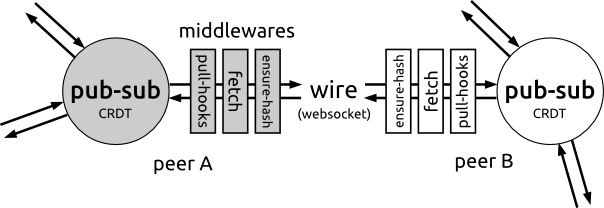

# kabel 

kabel (German for cable/wire) is a minimal, modern connection library
modelling a bidirectional wire to pass Clojure values between
endpoints. Peers in Clojure and ClojureScript are symmetric and hence
allow symmetric cross-platform implementations. Clojure peers can
connect to Clojure and ClojureScript peers in the same way and vice
versa. kabel uses web-sockets and transit is the serialization format.

## Rationale

Instead of implementing a `REST` interface websockets provide several
benefits, even if you do single requests. Most importantly the
distinction between server and client is unnecessary, because both can
push messages to each other, effectively having *one input* and *one
output* channel. Together with `edn` messages over the wire this
_simplifies_ the semantics significantly. The tradeoff is that `REST` is
standardized and offers better interoperablity for other clients.

Since we work on a crossplatform `p2p` software for confluent
replicated datatypes with
[replikativ](https://github.com/replikativ/replikativ), we could not
reuse any of the other ClojureScript client-side only websocket
libraries, e.g. [sente](https://github.com/ptaoussanis/sente) or
[chord](https://github.com/jarohen/chord). For us _all_ IO happens
over the input and output channel with `core.async`, so we can
implement *cross-platform* functionality in a very terse and
expressive fashion, e.g. in the [pull-hooks for
replikativ](https://github.com/replikativ/replikativ/blob/master/src/replikativ/p2p/hooks.cljc). But
you do not need to write platform neutral symmetric middlewares, so on
the JVM you can of course do IO without `core.async`.

We also extended and build
on [superv.async](https://github.com/replikativ/superv.async/) to catch all
exceptions in an Erlang style monitoring fashion and propagate them back through
a parametrizable error channel. We are thinking about ways to refactor kabel, so
that it can be decoupled from this error handling without losing the error
handling guarantees.

## Usage

Add this to your project dependencies:

From the tests (note that messages are always maps):

~~~ clojure
(ns kabel.core-test
  (:require [clojure.test :refer :all]
            [kabel.client :as cli]
            [kabel.http-kit :as http-kit]
            [kabel.peer :as peer]
            [superv.async :refer [<?? go-try S go-loop-try <? >? put?]]
            [clojure.core.async :refer [timeout]]
            [hasch.core :refer [uuid]]))

(defn pong-middleware [[peer [in out]]]
  (go-loop-try S [i (<? S in)]
               (when i
                 (>? S out i)
                 (recur (<? S in))))
  [peer [in out]])

(deftest roundtrip-test
  (testing "Testing a roundtrip between a server and a client."
    (let [sid #uuid "fd0278e4-081c-4925-abb9-ff4210be271b"
          cid #uuid "898dcf36-e07a-4338-92fd-f818d573444a"
          url "ws://localhost:47291"
          handler (http-kit/create-http-kit-handler! S url sid)
          speer (peer/server-peer S handler sid pong-middleware)
          cpeer (peer/client-peer S cid (fn [[peer [in out]]]
                                          (put? S out {:type :ping}) 
                                          (is (= (<?? S in)
                                                 {:type :ping
                                                  :sender sid
                                                  :host "localhost"}))
                                          [peer [in out]]))]
      (<?? S (peer/start speer))
      (<?? S (peer/connect cpeer url))
      (<?? S (timeout 1000))
      (<?? S (peer/stop speer)))))

~~~

The client-side works the same in ClojureScript from the browser.

## Design

There is a pair of channels for each connection, but at the core the
peer has a `pub-sub` architecture. Besides using some middleware
specific shared memory like a database you can more transparently pass
messages to other clients and middlewares through this pub-sub core or
subscribe to specific message types on it. It uses the pub-sub
semantics of `core.async`:

~~~ clojure
(let [[bus-in bus-out] (get-in @peer [:volatile :chans])
      b-chan (chan)]
  (async/sub bus-out :broadcast b-chan)
  (async/put! bus-in {:type :broadcast :hello :everybody})
  (<!! b-chan))
~~~

## Middlewares

You can find general middlewares in the corresponding folder. In
general middlewares themselves form a "wire" and can filter,
transform, inject and pass through messages.

We provide the following middlewares separately: - [Passwordless
authentication (and
authorisation)](https://github.com/replikativ/kabel-auth) based on
email verification or password and inter-peer trust network as p2p
middleware.

Useful middlewares still missing:
- QoS monitoring, latency and throughput measures
- remote debugging,
  sending [superv.async](https://github.com/replikativ/superv.async) exceptions
  back to the server
- other usefull `ring` middlewares which should be ported?  - ...

## Connectivity

More transport alternatives like long-polling with
SSEs, WebRTC or normal sockets should not be hard to add.

## TODO
- factor platform neutral logging
- implement node.js websocket server

## Changelog

### 0.1.9
    - factor start stop
    - support superv.async

### 0.1.8
    - small bugfixes

### 0.1.7
    - support node on client-side
    - add an aleph http client (server still missing)
    - add a generic callback middleware

### 0.1.5
    - use lightweight slf4j logging

### 0.1.4
    - expose consistent host ip

### 0.1.3
    - do not initialize http-client on compile time
      fixes aot uberjar compilation

### 0.1.2
    - properly close cljs client connection on initial error
    - add :sender peer-id to outgoing messages
    - add :connection url to incoming messages

## License

Copyright © 2015-2016 Christian Weilbach, 2015 Konrad Kühne

Distributed under the Eclipse Public License either version 1.0 or (at
your option) any later version.
